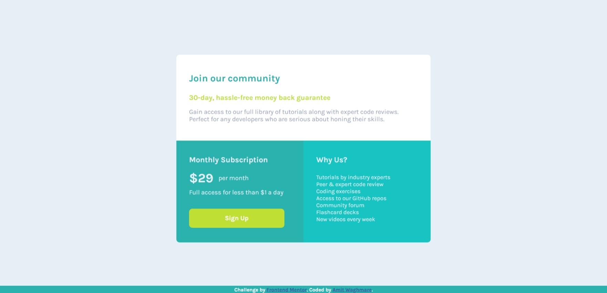
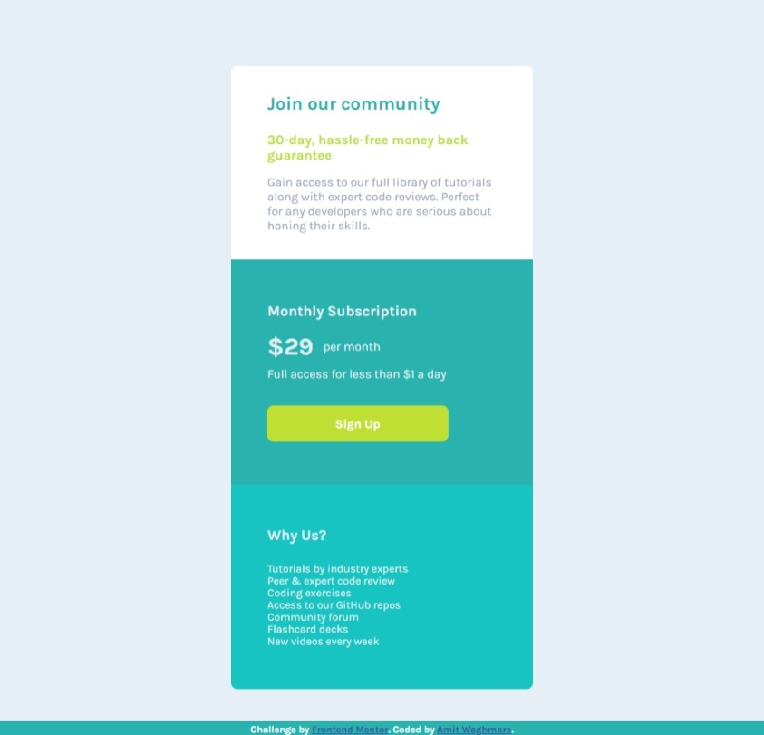

# Frontend Mentor - Single price grid component solution

This is a solution to the [Single price grid component challenge on Frontend Mentor](https://www.frontendmentor.io/challenges/single-price-grid-component-5ce41129d0ff452fec5abbbc). Frontend Mentor challenges help you improve your coding skills by building realistic projects. 

## Table of contents

- [Overview](#overview)
  - [The challenge](#the-challenge)
  - [Screenshot](#screenshot)
  - [Links](#links)
- [My process](#my-process)
  - [Built with](#built-with)
  - [What I learned](#what-i-learned)
  - [Continued development](#continued-development)
- [Author](#author)

## Overview

### The challenge

Users should be able to:

- View the optimal layout for the component depending on their device's screen size
- See a hover state on desktop for the Sign Up call-to-action

### Screenshot

#### desktop-view:

#### mobile-view:

These are the solution for the given challenge by frontend mentor of creating a single price grid layout. The page has been made responsive for different screen sizes.

### Links

- Solution URL: [See the solution.](https://www.frontendmentor.io/solutions/responsive-price-grid-landing-page-using-css-gx6qGKnDj3)
- Live Site URL: [Click here to view the live site!](https://price-grid-sigma-steel.vercel.app/)

## My process

### Built with

- Semantic HTML5 markup
- CSS custom properties
- Flexbox
- CSS Grid

### What I learned

This project have made the concept of CSS grid more easy for me. I was struggling with it in a previous project which I left working on, but now that I know about CSS grid, I will be continuing to work upon it!

### Continued development

There was a small issue which I faced while working upon the project, which was, I could not center the page, both, vertically and horizontally, but then I solved the issue for horizontally centering the page which was manipulating the width of the conatiner, but I couldn't fix the vertical centering issue; now I assume it could be because the whole page was in a container and I applied the flexbox property on the components of the whole container.

I would definitely overcome this issue in the future project with adding a container for the main body and then applying the flexbox property onto it and leaving the footer.

## Author

- Github - [Amit Waghmare](https://github.com/waghmare-amit)
- Frontend Mentor - [@waghmare-amit](https://www.frontendmentor.io/profile/waghmare-amit)
- Twitter - [@waghmareamit24](https://www.twitter.com/waghmareamit24)